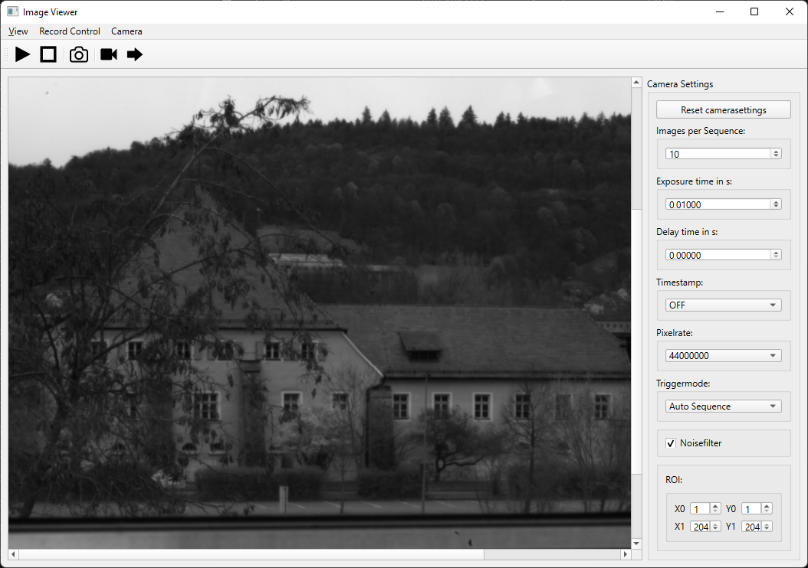

# pco.cpp-samples
This project contains different sample projects showing how to use Excelitas PCO's pco.cpp package,   
which can be downloaded here: [pco.cpp](https://www.excelitas.com/product/pco-software-development-kits#custom-tab-c__)

## Project Structure

```
.gitignore
README.md
LICENSE
CMakePresets.json
CMakeLists.txt
- doc
  - res
- externals
  - pco
- src
  - ColorConvertExample
  - FileModeExample
  - ImageViewer
  - MultiCameraExample
  - SimpleExample
  - SimpleExample_CamRam
  - SimpleExample_FIFO
```

**CMakeLists.txt** is the main cmake file and **CMakePresets.json** contains already predefined presets for building debug and release,
both on windows and linux platforms

All examples are in the **src** subfolder.
While **ImageViewer** is a small, Qt-based, GUI demo application, all other samples are one-file console programs.

The **externals/pco** folder contains also a **CMakeLists.txt** file which handles the pco.cpp dependencies

## Sample Description

### SimpleExample

This is a small console application which
1. Opens a camera
2. Sets an exposure time
3. Records a sequence of images
4. Saves the recorded images as tif files 
   - as RGB for color cameras
   - as BW for monochrome cameras
   - the 16bit raw image is also saved

**Note**: This way of saving image is only for a small amount of images / snapshots. 
If you need to store lots of images as files, either consider using our file modes (like shown in the **FileModeExample**)  
Or leverage any open source library for storing image files, e.g. OpenCV.

### SimpleExample_FIFO

This example is similar to **SimpleExample** but uses the ``pco::RecordMode::fifo``` instead of ```pco::RecordMode::sequence```,
so that the images are automatically read in a sequential order.

### SimpleExample_CamRam

This example is similar to **SimpleExample** but adapted to the workflow of PCO cameras with internal memory. 
Here you can only get a live image during record and read the actual images directly from the cameras internal memory when record is stopped.  

For this we have two different modes:  
- **```pco::RecordMode::camram_ring```** where the camera's memory is set up as a ring buffer (here we need to stop the recording manually)
- **```pco::RecordMode::camram_segment```** where the camera's memory is set up sequentially (here the recording stops automatically)

### ColorConvertExample

This example is similar to **SimpleExample** but additionally shows how to apply a pseudo color lut to the images of monochrome PCO cameras.  
Thus, this example also saves RGB images for monochrome cameras

### FileModeExample

This example shows how to use the ***file*** modes of our ```Camera``` class in order to directly stream the images from camera to file(s).  
Once recorded, you can access the images in the same way as shown in all the other examples.  

To keep this simple, the example just
1. Opens a camera
2. Sets an exposure time
3. Let you input the destination path for the files
   - During record it prints the number of already recorded images

**Note**: We made the example using ```pco::RecordMode::tif```, but the workflow is of course valid for all our file modes: 
- ```pco::RecordMode::tif```
- ```pco::RecordMode::multitif```
- ```pco::RecordMode::pcoraw```
- ```pco::RecordMode::b16```
- ```pco::RecordMode::dicom```
- ```pco::RecordMode::multidicom```

Especially when you want to record a lot of images, we recommend to use one of the multi-image file formats (multitif, pcoraw, multidicom)

### MultiCameraExample

This example shows how to work with two cameras in a very simple way.

For both cameras the following is done: 
1. Open a camera
2. Set an exposure time
3. Record a sequence of images
4. Saves the recorded raw images as tif files 

**Note**: The example doesn't synchronize between the two cameras. 
In many applications where multiple cameras are used, it is needed to sync the image acquisition.  
For this we highly recommend using external trigger signals and configure the camera to use hardware trigger, 
since this is the most accurate synchronization.

### ImageViewer

This is a demo application with a graphical user interface which is based on the Qt framework.  
- The top menu controls the recording, i.e here you can start and stop live view or record a sequence and navigate through this sequence
- The middle part displays the image
- The right side contains the most important settings of the camera configuration. While the exposure time can also be changed during record, all other settings require a stop and restart of the record.




## Installation

To use this example project you can either clone, fork or download the source code. 
After you have configured everything to your needs you can simply configure, build and install it using cmake.

### Configuration

The **CMakePresets.json** contain already predefined configurations for cmake builds on windows and linux.  

Beside of the preset name and description we have the following variables which you can configure to your needs: 

#### generator 
Here we use *Ninja* as it is available both on linux and on windows systems, but you can of course change this

#### binaryDir
This defines where the build files go to.  
Our default here is *<preset name>/build*, so e.g. *release_lnx/build* for the *release_lnx* preset

#### CMAKE_BUILD_TYPE
Build type. This matches with our preset names

#### CMAKE_INSTALL_PREFIX
This defines where the files should be installed to when calling ```cmake --install```
Our default here is *<preset name>/install*, so e.g. *release_lnx/install* for the *release_lnx* preset

#### PCO_PACKAGE_INSTALL_DIR
This specifies the root path to your installation of the **pco.cpp** package.  
Our default here is the system wide installation path, so normally you do not need to change it.  
If you installed pco.cpp on windows as user, you need to adapt this to the actual installation path of pco.cpp

#### QT_ROOT_DIR
**This is only relevant for building the ImageViewer demo**

This specifies the root path to your Qt installation. 
Our default is Qt 6.4.2 with the default folder Qt suggests.  
*You need to adapt this to the actual Qt install path on your system*

#### AUTO_UPDATE_PCO_PACKAGE
If this flag is set to true, the *./externals/pco/CMakeLists.txt* will automatically update the **pco.cpp** related files from the pco.cpp install path, e.g. when you install a new version of pco.cpp the examples will automatically be updated on the next reconfiguration.

If you want to disable this mechanism, just set ```"AUTO_UPDATE_PCO_PACKAGE": false``` 
